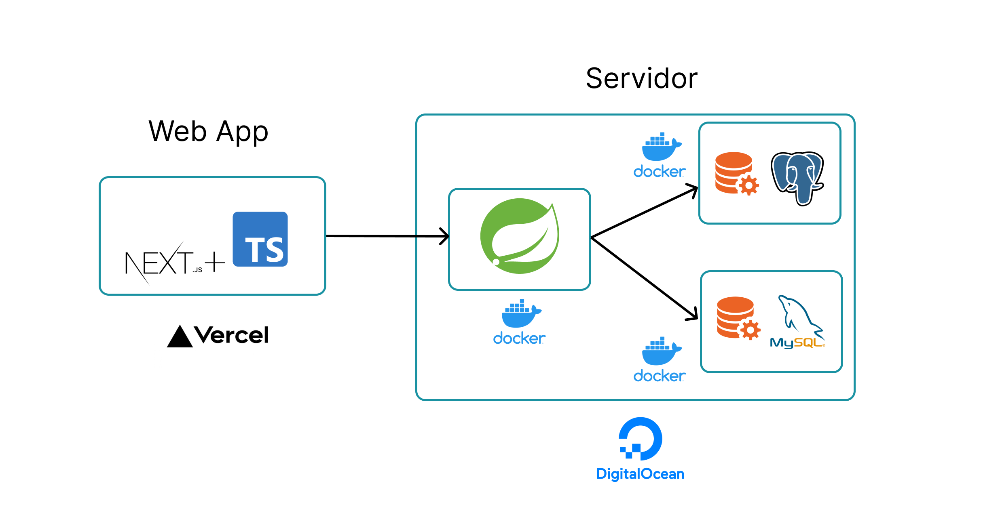
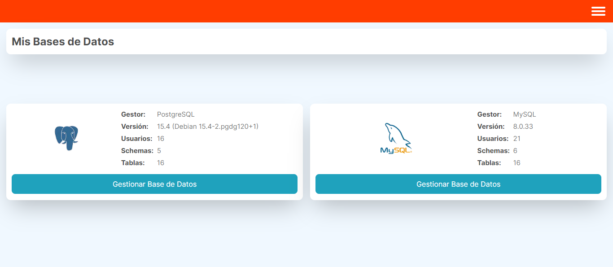
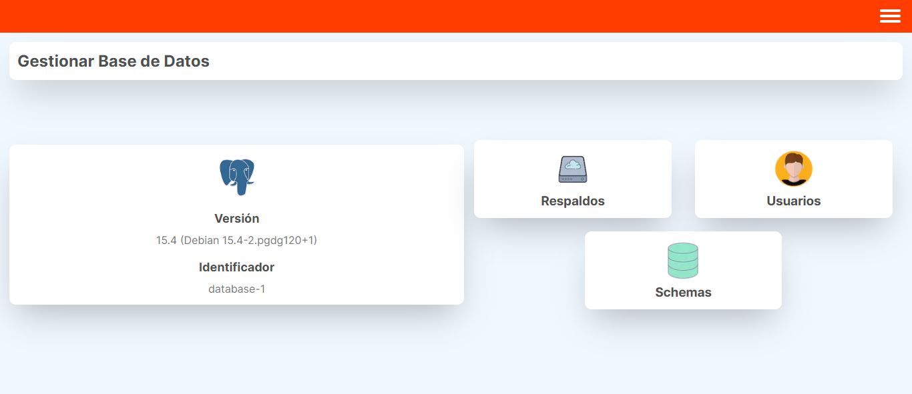
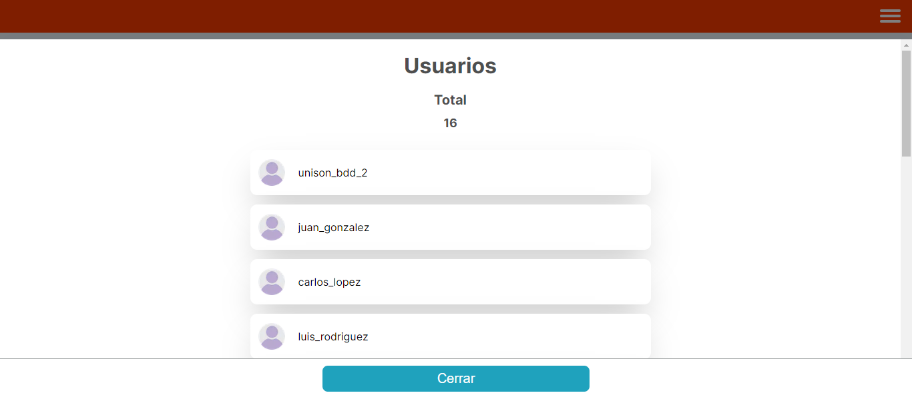
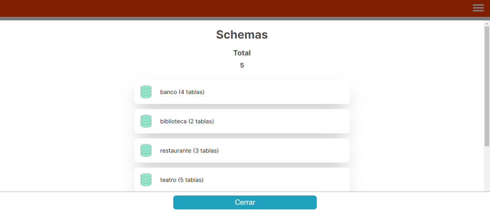
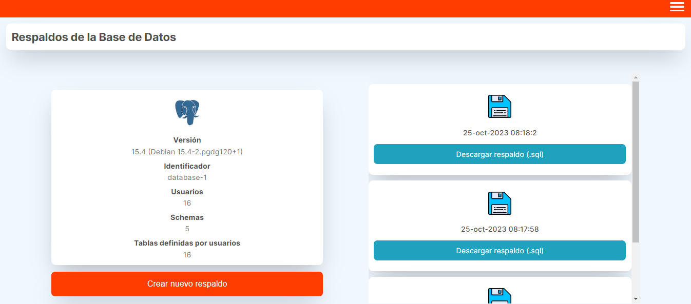

# Enlace a Página Web: https://respaldos-base-de-datos.vercel.app/

# Arquitectura 

- Frontend: Web construida con NextJS + Typescript desplegada en Vercel

- Backend: REST API construida con Java + Spring Boot desplegada en Digital Ocean

# Repositorio del backend
Para ver el repositorio del backend, favor de revisar el siguiente enlace: https://github.com/AlexAnguloMtz/Respaldo_Base_de_Datos_Servidor

# DBMS Utilizados 

Los manejadores elegidos fueron PostgreSQL 15.4 y MySQL 8.0.33

# Inicialización de datos

Ambos DBMS son inicializados mediante scripts en el servidor. Al momento de creación, ambos agregan los siguientes datos de manera automática:

- Un cierto número de usuarios cuyo nombre de usuario sigue el patrón 'nombre_apellido' usando nombres mexicanos 

- Un cierto número de schemas

- Un cierto número de tablas para cada uno de estos schemas

Esto fue con el fin de que al momento de descargar un respaldo, éste contenga verdaderos usuarios, schemas y tablas.

# Secciones de la página web

## Inicio

En inicio podemos ver nuestros dos DBMS y sus siguientes características:

- Versión
- Número de usuarios totales
- Número de schemas totales
- Número de tablas totales

El botón en la cima a la derecha nos muestra un menú que nos permite regresar a Inicio

## Dashboard del DBMS

En el dashboard del DBMS tenemos tres opciones:

- Respaldos: Nos lleva a la página de respaldos
- Usuarios: Nos muestra la lista de todos los usuarios
- Schemas: Nos muestra la lista de todos los schemas y cuantas tablas tiene cada uno en total

## Respaldos 

Página para crear y descargar respaldos. Contiene lo siguiente:

- Detalles de nuestra base de datos, que nuevamente contiene versión, ID de la base de datos, usuarios totales, schemas totales, y tablas totales. 

- Listado de todos los respaldos, en orden de más reciente a menos reciente. Los respaldos se pueden descargar dando click en "Descargar respaldo".

Al crear un respaldo, sseguirá un patrón de nombre DIA - MES - AÑO  HORA.sql   (Nótese la extensión .sql)

Al dar click en Crear Nuevo Respaldo, se crea un respaldo con la estampa de tiempo actual y se agrega a la lista en la posición más alta (reciente).

